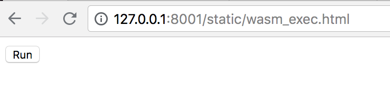
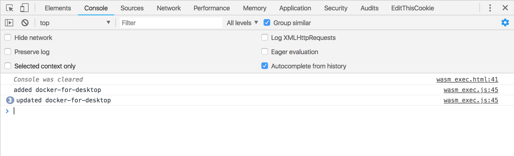

# Kubernetes and Web Assembly: I have far too much free time

Like many developers I was eagerly awaiting the latest Golang release. Modules where the real selling point for me, I can see myself using them on a regular basis for all my dependency needs. However, while the Go's new Module feature will be something I will use regularly, I was _really_ excited by Web Assembly support. I can put my finger on why I was so excited, I haven't done anything for the browser in nearly a year, but it was new and shiny and I wanted to build something. If I could figure out _what_ I wanted to build.

## What is Web Assembly

A quick aside about Web Assembly, for those that may not have heard about it. Web Assembly is a new binary instruction format for a stack based VM. What sets it aside from other formats and VMs is that Web Assembly is designed to run in browsers, all browsers, they all support it now.

This opens the door to a lot of cool things. Suddenly Javascript is not the only way to build the Web, If you can compile to Web Assembly you can run it in a browser. For example, I love the idea of the same language powering the front and back end and while I know this is possible with Node, until recently I have not been the biggest Node fan (Promises, Async/Await are awesome).

## What about Kubernetes

My main role is as a Platform Engineer, building and managing multiple Kubernetes clusters. I also build controllers and tooling for custom features not available by default. For example, a Hashicorp Vault Certificate controller that lets nodes rotate their certificates using Vault. So for my Web Assembly project it makes sense to do something with Kubernetes in mind. So as a MVP I decided to see if I could get the browser to talk to Kubernetes, using the official Golang Kubernetes libraries.

## The project

So, if I'm trying to connect to Kubernetes using Golang and Web Assembly then the first challenge then is to compile the Kubernetes client libraries. For this lets put together a sample program, something that will just watch Kubernetes Nodes and print changes to the console.

```go
package main

import (
	"context"
	"time"

	corev1 "k8s.io/api/core/v1"
	"k8s.io/client-go/informers"
	"k8s.io/client-go/kubernetes"
	"k8s.io/client-go/tools/cache"
	"k8s.io/client-go/tools/clientcmd"
)

func main() {
	restconfig, err := clientcmd.BuildConfigFromFlags("http://127.0.0.1:8001", "")
	if err != nil {
		panic(err)
	}

	client, err := kubernetes.NewForConfig(restconfig)
	if err != nil {
		panic(err)
	}

	factory := informers.NewSharedInformerFactory(client, time.Minute*5)
	factory.Core().V1().Nodes().Informer().AddEventHandler(cache.ResourceEventHandlerFuncs{
		AddFunc: func(obj interface{}) {
			println("added", obj.(*corev1.Node).GetName())
		},
		UpdateFunc: func(oldObj, newObj interface{}) {
			println("updated", newObj.(*corev1.Node).GetName())
		},
		DeleteFunc: func(obj interface{}) {
			println("deleted", obj.(*corev1.Node).GetName())
		},
	})

	ctx := context.Background()
	factory.Start(ctx.Done())

	<-ctx.Done()
}
```

After vendoring all the dependencies we can run the program and test it

```
$ go run ./main.go
added docker-for-desktop
updated docker-for-desktop
updated docker-for-desktop
updated docker-for-desktop
```

🎉 It works!

According the the Golang docs, in order to compile Go into Web Assembly you just set the `GOOS` to `js` and `GOARCH` to `wasm` and copy some Javascript files to load in the compiled code.

```
$ cp $(go env GOROOT)/misc/wasm/wasm_exec.{html,js} www
$ GOARCH=wasm GOOS=js go build -o www/test.wasm .
  # github.com/thatsmrtalbot/opsview/vendor/k8s.io/client-go/tools/clientcmd
  vendor/k8s.io/client-go/tools/clientcmd/auth_loaders.go:93:6: undefined: terminal.IsTerminal
  vendor/k8s.io/client-go/tools/clientcmd/auth_loaders.go:94:16: undefined: terminal.ReadPassword
```

Well I didn't honestly expect for it to compile first time. The issue seems to stem from the "golang.org/x/crypto/ssh/terminal", this is a library to detect if the code is running on a terminal and perform tasks like reading in passwords. The package itself consists of a `util.go` file containing the unix implementations, then files like `util_linux.go` and `util_windows.go` providing operating system specific implementations. Obviously this wasn't build with Web Assembly in mind, so implementations need to be added for it. 

```go
// +build js
package teminal

import "errors"

// IsTerminal returns true if the given file descriptor is a terminal.
func IsTerminal(fd int) bool {
	return false
}

// ReadPassword reads a line of input from a terminal without local echo.  This
// is commonly used for inputting passwords and other sensitive data. The slice
// returned does not include the \n.
func ReadPassword(fd int) ([]byte, error) {
	return nil, errors.New("unsupported")
}
```
[commit here](https://github.com/thatsmrtalbot/crypto/commit/7b5c2bdb526661143f99d3e7cdcbc427038d684c)

Lets try compiling my test application again:

```
$ GOOS=js GOARCH=wasm go build -o www/test.wasm .
$ echo $?
  0
```

Unexpectedly, the code compiles! However thats only half the battle, we also need to see if it runs. We can proxy the Kubernetes _and_ serve our code with a single command. 

```
$ kubectl proxy -w www
  Starting to serve on 127.0.0.1:8001
```

This will proxy the Kubernetes API (without auth) while serving your content in `/static`. When I loaded `http://127.0.0.1:8001/static/wasm_exec.html` I was greeted by a button marked "Run". 



Clicking the button started the Golang application, which to my surprise worked!



## Conclusion 

Its fully possible to connect to Kubernetes, using the official Golang libraries, from the browser, using Web Assembly. This could be used for dashboarding, informational views, etc. In theory its possible to run controllers in the browsers (if your crazy enough). More then anything this is a technical exercise and further proof that I have far too much time on my hands. 